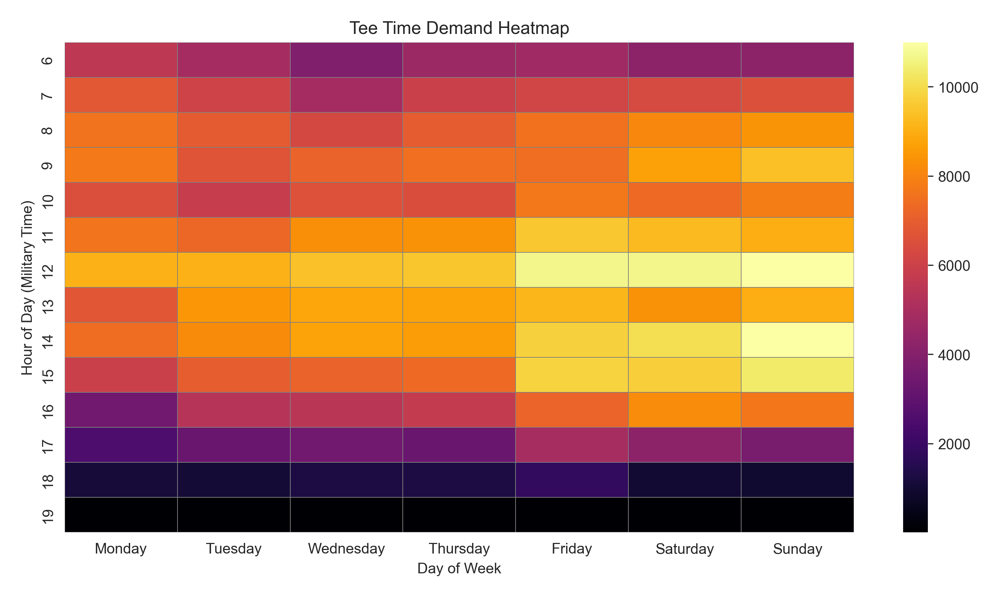
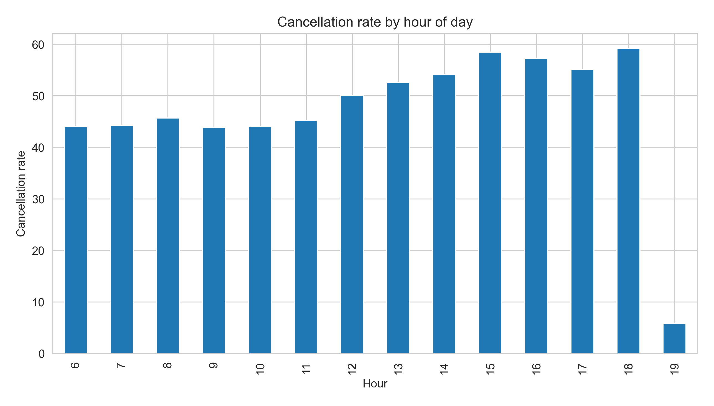
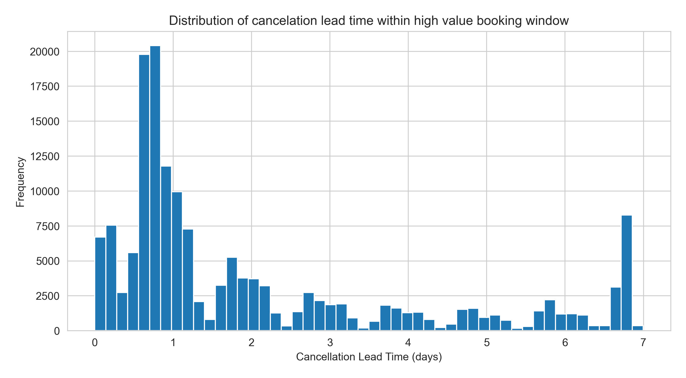
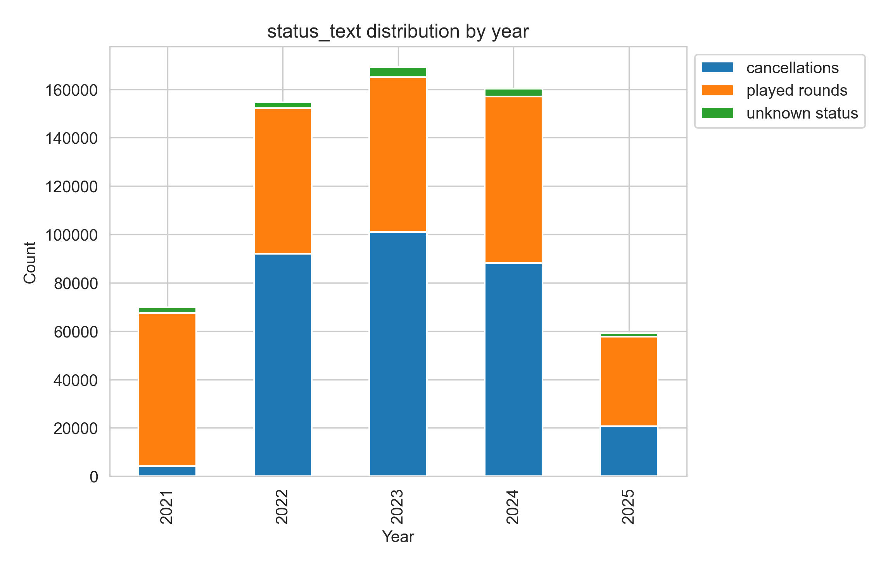

# Bethpage State Park Tee Time Booking Automation Analysis
Analysis of Bethpage State Park tee-time data (2021–2025) focusing on the prevalence of automated booking abuse,
and the effectiveness of recent booking rule changes in reducing such behavior.

## Background & Motivation
This analysis is inspired by [episode 945 of the No Laying Up Podcast](https://nolayingup.com/podcasts/no-laying-up-podcast/945-nlu-special-projects-the-mystery-behind-why-bethpage-is-always-booked), 
in which Kevin Van Valkenburg investigates the seemingly herculean task of securing a tee time at Bethpage State Park. Bethpage is a public facility with five
18-hole golf courses, including the lauded Black Course, host to the 2025 Ryder Cup. As highlighted in the podcast,
one major contributor to the perpetual unavailability of these tee times is the deployment of automated booking
software by individuals and organized resellers. Such programs are able to secure large blocks of tee times fractions of
seconds after release time, before most users are able to load the booking web page. This dynamic has raised concerns about
equitable access and the operational integrity of the booking system.

In April 2025, a few months after the podcast aired, Bethpage announced booking policy changes designed to discourage
automated intervention in the booking process. These changes included a new booking fee, increased
no-show penalties, and monthly cancellation limits. The focus of this analysis is to evaluate the extent to
which automated booking activity may have influenced booking behavior prior to these rule changes, and to gauge their
effectiveness in discouraging system abuse.

It is important to note that shortly after the dataset was requested via a New York State FOIL request, Bethpage announced
a more robust set of rule changes set to take effect in October 2025. The centerpiece of this second policy update is the
implementation of two-factor authentication during the booking process, which will likely be much more, if not completely,
effective in stopping automated booking. A future FOIL request in the fall of 2026 could enable a follow-up analysis comparing
booking behavior across all three policy eras.

## Project Goals
- Quantify tee time inventory patterns at Bethpage State Park from 2021 to 2025
- Identify signals and patterns consistent with automated booking systems, including timing, volume, and cancellation behavior
- Compare booking behavior before and after the April 2025 rule changes
- Evaluate the impact of these rule changes on user behavior
- Establish a repeatable analysis framework to enable future analysis of the October 2025 rule change

## Exploratory Data Analysis

Initial exploratory analysis focused on establishing baseline demand patterns and identifying behavioral signals potentially
consistent with speculative or automated booking activity.

### System Baseline Findings

- Tee time demand is heavily concentrated between approximately 11:00 AM and 3:00 PM, with peak demand centered around noon on weekdays and slightly later on weekends
- Weekend demand is substantially higher than weekday demand, particularly during the identified high-demand booking window
- Approximately 49.7% of all bookings in the dataset ultimately resulted in cancellation

These analyses establish the primary "high-value inventory" window used throughout the remainder of the project.

### Cancellation Behavior Findings
Analysis of cancellation behavior identified several patterns inconsistent with simple single-intent booking behavior:

 
 

- Cancellation rates increase during high-demand tee time windows, exceeding 50% during many afternoon hours
- Nearly half of all cancellations occur within 24 hours of the scheduled tee time
- The distribution of cancellation lead time is heavily skewed toward short-notice cancellations
- High-demand tee times (11:00 AM–3:00 PM) exhibit an even stronger concentration of short lead-time cancellations relative to the overall population

While these findings alone do not prove the presence of automated booking systems, they are consistent with speculative inventory holding behavior and establish a foundation for deeper timing-based analysis.

### Notes on Year-over-Year Comparisons
Year-over-year comparisons were considered but are not currently a primary focus of the analysis due to major external supply-side distortions within the dataset:

- 2021 demand patterns were likely affected by COVID-era restrictions
- 2025 data represents a partial year and includes substantial course availability reductions related to Ryder Cup preparation

Because these conditions materially affect tee time supply, year-over-year totals alone are not considered reliable indicators of booking behavior changes.

## Planned Work
- Analyze booking timestamps relative to official tee time release windows to identify abnormal booking concentration immediately after release
- Compare booking and cancellation behavior before and after the April 2025 policy changes
- Quantify instability within high-demand inventory windows
- Seek to cluster booking records into behavioral groups to identify repeatable abnormal usage patterns
- Develop a repeatable analytical framework for future comparison against the October 2025 two-factor authentication rule changes

## Repository Structure
- System and infrastructure files will be omitted here for clarity
- data
  - cleaned
    - contains the full processed data file in parquet format, also contains a sample CSV of 50,000 randomly selected rows
  - raw
    - contains Excel sheets with the raw FOIL request data for each year in the review period (2021-2025)
- docs
  - contains useful information on booking policy changes, cleaning phase documentation and lab notes, and raw data notes
- figures
  - graphs, etc. to be used in final reports
- notebooks
  - contains jupyter notebooks used to develop and validate code structure and flow for each phase of the project
- src
  - contains the final source code for the project. These are typically based on the corresponding jupyter notebooks mentioned above
  refactored to .py format
- .gitignore
  - lists files and folders to be excluded from git tracking
- README.md
  - explains project goals and summarizes results

## Data Source & Ethics
The data for this project were sourced from a New York State Freedom of Information Law request. The data are anonymized
listings of tee time inventory transactions. This analysis will make no attempt to identify individuals, and rather
cannot be used to do so, given the level of specificity provided.

